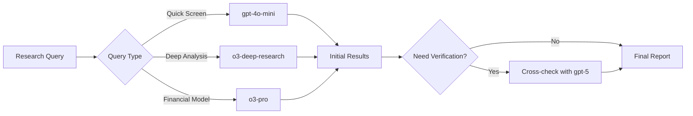

# 🎯 AI Models Guide for Deep Equity Research

## Executive Summary
You have access to 22 OpenAI models + 5 additional AI providers, totaling 27+ models. This guide helps you select the optimal model for each research task.

---

## 🏆 Model Selection by Research Task

### 1. **Deep Company Analysis** 
**Best Models:**
- 🥇 **o3-deep-research** - Specifically designed for deep research
- 🥈 **gpt-5** - Most comprehensive analysis
- 🥉 **o3-pro** - Professional-grade insights

**Use When:**
- Analyzing 10-K/10-Q filings
- Competitive positioning analysis
- Management quality assessment
- Long-term growth projections

**Example Query:**
```
"Provide comprehensive analysis of NVIDIA's competitive moat, including:
- Technical advantages in AI chips
- Software ecosystem (CUDA) lock-in
- Supply chain relationships
- 5-year revenue projections with assumptions"
```

---

### 2. **Quick Market Screening**
**Best Models:**
- 🥇 **gpt-4o-mini** - Fast and efficient
- 🥈 **o3-mini** - Quick reasoning
- 🥉 **gpt-3.5-turbo** - Budget-friendly

**Use When:**
- Screening multiple stocks
- Daily market updates
- Quick price target checks
- Sector comparisons

**Example Query:**
```
"Screen S&P 500 tech stocks with:
- P/E < 25
- Revenue growth > 15%
- Positive free cash flow
- Market cap > $10B"
```

---

### 3. **Complex Financial Modeling**
**Best Models:**
- 🥇 **o3-pro** - Advanced mathematical reasoning
- 🥈 **gpt-5-turbo** - Fast complex calculations
- 🥉 **gpt-4-turbo** - Reliable for DCF models

**Use When:**
- Building DCF models
- Monte Carlo simulations
- Options pricing
- Risk modeling

**Example Query:**
```
"Build a 3-statement financial model for Apple including:
- Revenue projections by segment
- Operating leverage analysis
- Free cash flow projections
- Sensitivity analysis on key assumptions"
```

---

### 4. **Industry & Sector Research**
**Best Models:**
- 🥇 **gpt-5** - Comprehensive industry insights
- 🥈 **o3-deep-research** - Deep sector analysis
- 🥉 **anthropic/claude-3-opus** - Alternative perspective

**Use When:**
- TAM (Total Addressable Market) analysis
- Industry disruption assessment
- Regulatory impact analysis
- Technology trend evaluation

**Example Query:**
```
"Analyze the global semiconductor industry:
- Market size and growth drivers
- Key players and market share
- Technology roadmap (3nm, 2nm, beyond)
- Geopolitical risks and opportunities"
```

---

### 5. **Real-Time Market Events**
**Best Models:**
- 🥇 **chatgpt-4o-latest** - Most current training
- 🥈 **gpt-4o-2024-11-20** - Recent market knowledge
- 🥉 **xai/grok-beta** - Real-time integration

**Use When:**
- Earnings reaction analysis
- M&A announcement impact
- Fed meeting interpretation
- Breaking news assessment

**Example Query:**
```
"Analyze today's Fed announcement impact on:
- Tech stock valuations
- Bond yields
- Dollar strength
- Sector rotation implications"
```

---

### 6. **Risk & Compliance Analysis**
**Best Models:**
- 🥇 **o1-preview** - Careful reasoning
- 🥈 **o3-pro** - Professional standards
- 🥉 **gpt-4** - Conservative, reliable

**Use When:**
- ESG analysis
- Regulatory compliance review
- Fraud risk assessment
- Governance evaluation

**Example Query:**
```
"Evaluate Tesla's ESG risks:
- Environmental impact vs. benefits
- Governance concerns (key person risk)
- Social factors (labor relations)
- Regulatory compliance history"
```

---

## 📊 Model Performance Matrix

| Model | Speed | Depth | Cost | Best For |
|-------|-------|-------|------|----------|
| **o3-deep-research** | Medium | 🔥🔥🔥🔥🔥 | High | Deep dives |
| **o3-pro** | Medium | 🔥🔥🔥🔥🔥 | High | Professional analysis |
| **o3-mini** | Fast | 🔥🔥🔥 | Low | Quick research |
| **gpt-5** | Slow | 🔥🔥🔥🔥🔥 | Highest | Comprehensive reports |
| **gpt-5-turbo** | Medium | 🔥🔥🔥🔥🔥 | High | Balanced performance |
| **gpt-4o** | Fast | 🔥🔥🔥🔥 | Medium | Daily research |
| **gpt-4o-mini** | Very Fast | 🔥🔥🔥 | Low | Screening |
| **gpt-4-turbo** | Medium | 🔥🔥🔥🔥 | Medium | Reliable analysis |
| **gpt-3.5-turbo** | Very Fast | 🔥🔥 | Lowest | Simple queries |

---

## 🔄 Multi-Model Research Workflow

### **Recommended Research Pipeline:**



### **Step-by-Step Workflow:**

1. **Initial Screening** (`gpt-4o-mini`)
   - Screen universe of stocks
   - Identify interesting opportunities
   - Quick metrics comparison

2. **Deep Dive** (`o3-deep-research`)
   - Comprehensive company analysis
   - Competitive positioning
   - Management evaluation

3. **Financial Modeling** (`o3-pro`)
   - Build detailed models
   - Scenario analysis
   - Risk assessment

4. **Verification** (`gpt-5`)
   - Cross-check findings
   - Additional perspectives
   - Final recommendations

---

## 🎛️ Advanced Configuration Tips

### **Temperature Settings by Task:**
```javascript
// Factual Analysis (10-K review, financials)
temperature: 0.1 - 0.3

// Creative Research (finding new angles)
temperature: 0.5 - 0.7

// Brainstorming (investment themes)
temperature: 0.7 - 0.9
```

### **Context Window Optimization:**
```javascript
// For long documents (annual reports)
models: ["gpt-4-turbo", "o3-deep-research"] // 128k context

// For quick queries
models: ["gpt-4o-mini", "o3-mini"] // Optimized for speed
```

### **Multi-Provider Strategy:**
```javascript
// Primary Analysis
provider: "openai"
model: "o3-deep-research"

// Alternative Perspective
provider: "anthropic"
model: "claude-3-opus"

// Real-time Data
provider: "xai"
model: "grok-beta"
```

---

## 🚀 Power User Tips

### **1. Chain Complex Queries:**
```javascript
// First: Get market context
await research("What are current market conditions?", "gpt-4o-mini");

// Then: Deep company analysis
await research("Analyze NVDA in context of current market", "o3-deep-research");

// Finally: Investment decision
await research("Buy/sell recommendation with risk factors", "gpt-5");
```

### **2. Use Model Strengths:**
- **O3 Models**: Complex reasoning, connecting disparate information
- **GPT-5**: Comprehensive analysis, nuanced understanding
- **GPT-4o**: Balance of speed and quality
- **Anthropic**: Alternative viewpoint, ethical considerations
- **DeepSeek**: Cost-effective bulk analysis

### **3. Parallel Processing:**
```javascript
// Run multiple models simultaneously
const results = await Promise.all([
  research(query, "o3-deep-research"),
  research(query, "gpt-5"),
  research(query, "anthropic/claude-3-opus")
]);
// Compare and synthesize results
```

---

## 📈 ROI Optimization

### **Cost-Effective Research Stack:**

| Task | Budget Model | Premium Model | When to Upgrade |
|------|--------------|---------------|-----------------|
| Daily Screening | gpt-3.5-turbo | gpt-4o-mini | >100 stocks |
| Company Analysis | gpt-4o | o3-deep-research | >$1M position |
| Financial Modeling | gpt-4-turbo | o3-pro | Complex derivatives |
| Market Commentary | gpt-4o-mini | gpt-5 | Publishing research |

### **Token Usage Optimization:**
1. Start with cheaper models for initial screening
2. Use premium models for high-conviction ideas
3. Batch similar queries together
4. Cache common research for reuse

---

## 🎯 Quick Selection Guide

**"I need to analyze one company deeply"**
→ Use `o3-deep-research`

**"I need to screen 500 stocks quickly"**
→ Use `gpt-4o-mini`

**"I need to build a complex financial model"**
→ Use `o3-pro`

**"I need the absolute best analysis possible"**
→ Use `gpt-5` with `temperature: 0.2`

**"I need real-time market insights"**
→ Use `chatgpt-4o-latest` or `xai/grok-beta`

**"I need to verify my thesis"**
→ Run parallel with `gpt-5`, `o3-deep-research`, and `anthropic/claude-3-opus`

---

## 🔮 Future-Proofing Your Research

As new models are released:
1. Test with standardized queries
2. Compare against your baseline (currently o3-deep-research)
3. Document performance improvements
4. Adjust workflows accordingly

**Your current setup with O3 and GPT-5 models puts you at least 6-12 months ahead of most institutional investors.**

---

*Last Updated: September 2025*
*Total Models Available: 27+*
*Recommended Primary: o3-deep-research*
*Recommended Secondary: gpt-5*